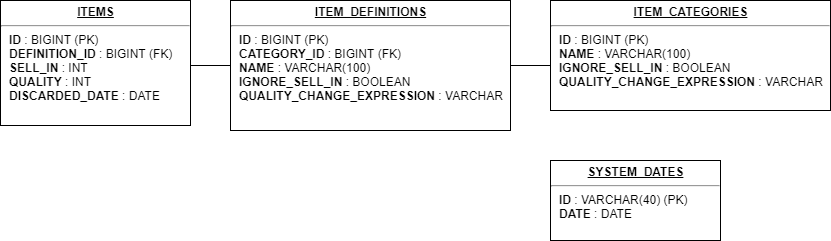
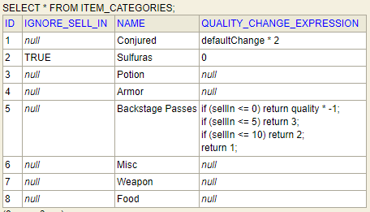
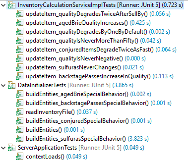
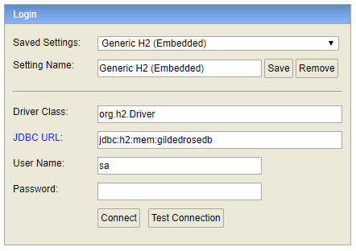
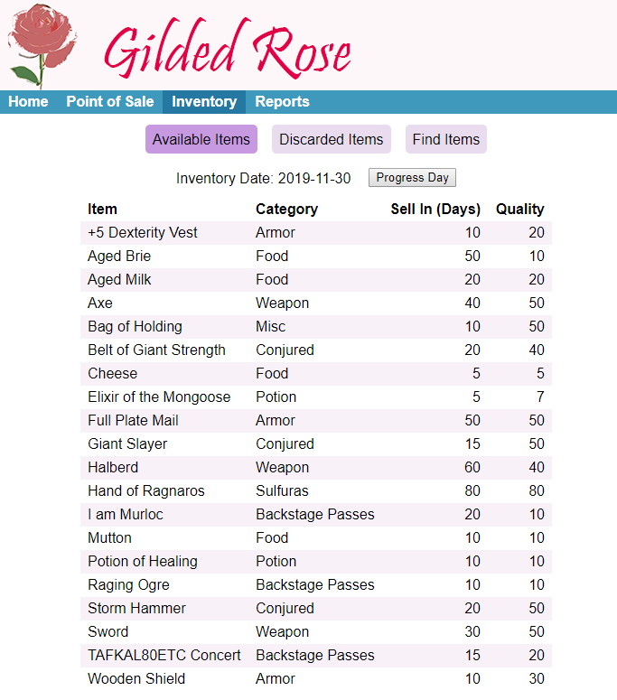

# Gilded Rose

## The Solution

The technologies I chose to implement this project were Java, Spring Boot, JUnit, H2 (database), Angular, Quartz and
Groovy.

Technologies I excluded using (that I likely would have if this were a real project) were Spring Security, Mockito,
MockMvc and Bootstrap (CSS).

For the most part, I tried to implement this in a realistic way, however there are few places that I did things
differently than I normally would, in order to save time. I'll just call them out here:
* The styling of the UI was done pretty basic, and I didn't focus on responsiveness.
* I generally would not use HttpClient within Angular components. My normal approach is to make all HTTP calls from
within a service. The service provides common function like error handling and transformation of JSON data into more
usable model objects.
* I did not include Selenium, integration or MockMvc tests.

The following sections explain the design (high-level) of my solution, how it is tested and how to run it.

### Design
In order to accommodate the likely need to support multiple instances of the same item, and to provide normalization of the persisted items, the following database schema was used.

Not only does this schema save us from repeating item and category names within the database, but it also provides locations to store settings that customize the daily calculations based on item or category. The following columns are used for this.

* IGNORE_SELL_IN: When set to true, indicates that the sellIn value does not apply to the given item or category of items.
* QUALITY_CHANGE_EXPRESSION: A Groovy expression which will calculate the daily change in quality for the given item or category of items.

To demonstrate this, the following is the ITEM_CATEGORIES table. The "Conjured", "Sulfuras" and "Backstage Passes" records have custom values in one or more of these columns.

My first pass at the logic was to simply hard-code it all (can be seen in commit history). I wrote all the unit tests
against that. I then swapped out parts of the logic for Groovy expressions, ensuring that the tests still passed. There
are pros and cons to the solution (Groovy) that I chose, but ultimately I felt it was the better of the two. Here are
the pros and cons that I see:

Pros:
  * Logic is attached to item definition and item category records. Items and categories can be added, renamed or
  deleted and the logic follows.
  * Being isolated as it is, logic for one item cannot accidentally affect the calculation for other items.
  * Logic could be made available for editing by an end user (may or may not be a good idea).

Cons:
  * May be a bit more confusing for a new developer to understand.
  * Unit tests of the logic need to be kept in sync with changes to the logic. Ideally a developer would update the
  unit tests whenever logic changes are made.

To track the current date of the inventory, I have added the SYSTEM_DATES table. It has a single record which holds the
date for which item values were last calculated.

Loading of data into the schema is done at application startup by the com.gildedrose.DataInitializer class. It reads the
inventory.txt file, builds the JPA entities and persists them to the database. It is also responsible for populating the
values of the IGNORE_SELL_IN and QUALITY_CHANGE_EXPRESSION columns on the entities.

Regarding class types used in the Java layer, I kept it reasonably slim. Flow of control for a request is as follows:
	
	RestController ---> ServiceImpl ---> JPA EntityManager ---> (database)

In larger, more complex systems I would often include a Repository layer, along with Converter classes dedicated to
converting entities to DTO (data transfer objects). However, all that felt like overkill for this solution as the
service layer is able to work with the EntityManager, and the code is straight-forward.

Quartz was used in order to run the inventory calculations on a schedule. I have the job set to run every 15 seconds
(for development), but it only does anything if the inventory date (in SYSTEM_DATES) is in the past. When it runs, it
will calculate inventory values up to the current date by repeatedly running the service that progresses the inventory
by one day.

### Testing
Ensuring that the logic needed to compute sellIn and quality values is correct (and stays that way after future
enhancements) is very important. For this reason I chose to focus my testing efforts on this area. There are two areas
of the code that need to be rigorously tested in order to achieve this goal:

* com.gildedrose.DataInitializer
* com.gildedrose.service.InventoryCalculationServiceImpl

The DataInitializer class handles the initial import of data into the system. It is important to ensure that data is
being read correctly, and that the initial JPA entities are being built correctly. The DataInitializerTests class has
tests that address this area.

The InventoryCalculationServiceImpl class performs the daily calculation of each item. This is where the calculation
logic lives, and also where the Groovy expressions defining custom logic get executed. The
InventoryCalculationServiceImplTests class addresses each requirement with a unit test that progresses an item through
as series of days, and validates that the item's values are correct on each given day. It also validates that items are
correctly marked as discarded (setting of the DISCARDED_DATE) when their quality becomes zero.

The following screenshot shows all the unit tests which were written:

### Running the Application

**Server**

The server project is built with Maven. I used Spring Tool Suite 4 and JDK 1.8 to develop and run the server project.
It is configured to run on port 8080 (in application.properties).

To keep things simple, I used the H2 in-memory database. No database setup is necessary.

The H2 Console is enabled in application.properties, and thus the database console can be accessed at
http://localhost:8080/h2-console when the server is running. To log in, ensure the login form looks as follows:

The SQL produced by the system can be logged to the console by setting 'spring.jpa.show-sql' to true in the
application.properties file.

**Scheduled Job**

Output from the scheduled Quartz job will appear in the console every 15 seconds. By default it will not update any
values since the inventory date is current. To see the job execute, use the H2 Console to set the inventory date back
several days.

    update system_dates set date = '2019-11-28';

**Postman**

I have provided a Postman collection file in the root of the repository. It has a request to test each of the available
REST APIs.

**Client**

The client is a standard Angular application. Standard instructions are in the Client/README.md file.

From within the client folder, run:
* npm install
* ng serve

The url is http://localhost:4200

The Inventory page provides function to:
* View available and discarded items
* Progress the inventory date
* Find an item by name

## The Problem
Hi and welcome to team Gilded Rose. As you know, we are a small inn with a prime location in a prominent city run by a friendly innkeeper named Allison. We also buy and sell only the finest goods. Unfortunately, our goods are constantly degrading in quality as they approach their sell by date. We need you to write a system that allows us to manage our inventory, so that we are able to service all of the adventurers who frequent our store (we don't want to run out of healing potions when an tiefling comes in unlike last time - poor Leeroy).

Here are the basic rules for the system that we need:

1. All items have a SellIn value which denotes the number of days we have to sell the item
2. All items have a Quality value which denotes how valuable the item is
3. At the end of each day our system lowers both values for every item

Since this is the real world, there are some edge cases we need for you to account for as well:

1. Once the sell by date has passed, Quality degrades twice as fast
2. The Quality of an item is never negative
3. "Aged Brie" actually increases in Quality the older it gets
4. The Quality of an item is never more than 50
5. "Sulfuras", being a legendary item, never has to be sold or decreases in Quality
6. "Backstage passes", like aged brie, increases in Quality as it's SellIn value approaches; Quality increases by 2 when there are 10 days or less and by 3 when there are 5 days or less but Quality drops to 0 after the concert
7. "Conjured" items degrade in Quality twice as fast as normal items
8. An item can never have its Quality increase above 50, however "Sulfuras" is a legendary item and as such its Quality is 80 and it never alters.

We currently keep our inventory in a hand written list. Since Allison wants to get home at night, we keep the writing to a minimum. Each line has the following information, in order:

1. Item Name
2. Item Category
3. Sell In
4. Quality

### Additional Requirements:
1. There is no requirement for what you choose as your interface into the system, however whatever interface you choose should, at a minimum, provide for the following commands:
	1. Ask for the entire list of inventory
	2. Ask for the details of a single item by name
	3. Progress to the next day
	4. List of trash we should throw away (Quality = 0)
2. In this repo, you will find an inventory.txt file. This is the initial inventory your solution should load. After that, you may store the data however you wish.

## The Fine Print
Please use whatever technology and techniques you feel are applicable to solve the problem. We suggest that you approach this exercise as if this code was part of a larger system. The end result should be representative of your abilities and style.

Please fork this repository, then when you have completed your solution, issue a pull request to notify us that you are ready for us to review your submission.

Have fun.

## Things To Consider
Here are a couple of thoughts about the domain that could influence your response:

* The world is a magical place - you never know when the next "special requirement" might pop up - how can you make this painless?
* Keep in mind that accurate inventory is a must for the shop, how might you ensure that the future programmer who takes over the code while you are off adventuring doesn't mistakenly mess things up?
