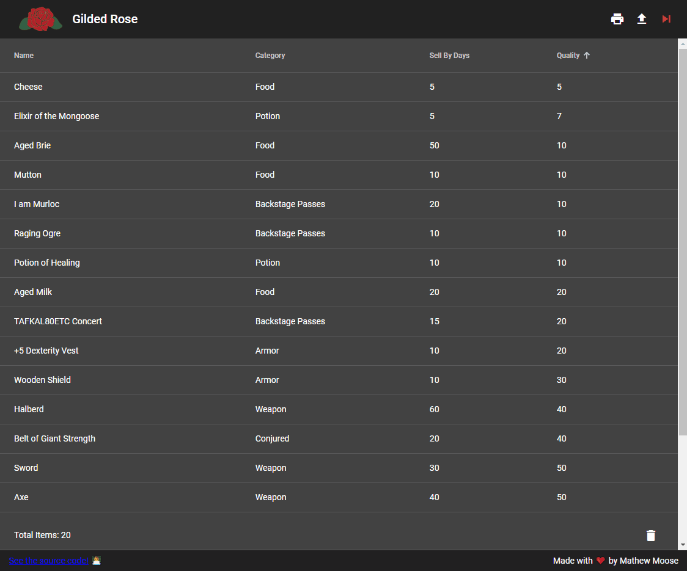

# Gilded Rose
Gilded Rose is the solution for a coding exercise problem named after the same name.
The original prompt can be found at the bottom of this page, and the working solution is outline below.

## [Live Site](https://xmoose25x.github.io/GildedRose/)
## Demo

## Technologies used

* [Gradle](https://gradle.org/) - Build Framework
* [PMD](https://pmd.github.io/) - Static Analysis Tool
* [JUnit 5](https://junit.org/junit5/) - Java Unit Testing Framework
* [Karma](https://karma-runner.github.io/latest/index.html) - JavaScript Unit Testing Framework
* [PiTest](https://pitest.org/) - Mutation Testing Tool
* [Spring Boot](https://spring.io/projects/spring-boot) - Opinionated Server-Side Java Spring Framework 
* [Angular](https://angular.io/) - Client-Side JavaScript Framework

## Documentation

## How to build

The GildedRose application is structured as a gradle multi-project build. 

To build all components use:

`gradlew build`

To build an individual project typically you will use:

`gradlew :<project-name>:mainBuild`

Certain projects may have different commands to build. Those commands are documented in the 
`README.md` of those projects. 

## Deployments
The application is split between [Heroku](https://dashboard.heroku.com/) for hosting the server project
and [Github Pages](https://pages.github.com/) for the web project.

* The [Procfile](./Procfile) and [system.properties](./system.properties) control the Heroku deployment.
* The [docs folder](./docs) controls the content deployed to Github Pages (and is rebuilt via `gradlew deploy`).

## What projects are in this repository

The names of the various projects can be found in one of two ways:

1. Execute `gradlew projects`

1. Check the [settings.gradle](./settings.gradle) file's `include` list

## How to add a project

1. Add a folder in this directory for the new project

1. Add the name of the folder to the `include` list in [settings.gradle](./settings.gradle)

1. Add a `build.gradle` to the new project folder for any project-specific build configuration

1. Add a `src` folder to the project

## Quality

### Static Analysis

#### PMD

For Java projects `PMD` is used to analyze the code and enforce code quality. 

`PMD` is executed via the build, but to run it directly the following command can be used:

`gradlew pmdMain pmdTest`

To build upon and override the default rule set, a custom local configuration is used: [pmd-exclusions.xml](./resources/pmd-exclusions.xml)

### Testing

#### PiTest

For Java projects `PiTest` is used to analyze test quality through Mutation Testing. 

`PiTest` is not ran via the build to avoid enforcing an arbitrary mutation coverage. 
It can be executed via the following command:

`gradlew pitest`

#### JUnit + Karma

Tests can be executed via

`gradlew test`

## The Original Problem Prompt
Hi and welcome to team Gilded Rose. As you know, we are a small inn with a prime location in a prominent city run by a friendly innkeeper named Allison. We also buy and sell only the finest goods. Unfortunately, our goods are constantly degrading in quality as they approach their sell by date. We need you to write a system that allows us to manage our inventory, so that we are able to service all of the adventurers who frequent our store (we don't want to run out of healing potions when an tiefling comes in unlike last time - poor Leeroy).

Here are the basic rules for the system that we need:

1. All items have a SellIn value which denotes the number of days we have to sell the item
2. All items have a Quality value which denotes how valuable the item is
3. At the end of each day our system lowers both values for every item

Since this is the real world, there are some edge cases we need for you to account for as well:

1. Once the sell by date has passed, Quality degrades twice as fast
2. The Quality of an item is never negative
3. "Aged Brie" actually increases in Quality the older it gets
4. The Quality of an item is never more than 50
5. "Sulfuras", being a legendary item, never has to be sold or decreases in Quality
6. "Backstage passes", like aged brie, increases in Quality as it's SellIn value approaches; Quality increases by 2 when there are 10 days or less and by 3 when there are 5 days or less but Quality drops to 0 after the concert
7. "Conjured" items degrade in Quality twice as fast as normal items
8. An item can never have its Quality increase above 50, however "Sulfuras" is a legendary item and as such its Quality is 80 and it never alters.

We currently keep our inventory in a hand written list. Since Allison wants to get home at night, we keep the writing to a minimum. Each line has the following information, in order:

1. Item Name
2. Item Category
3. Sell In
4. Quality

### Additional Requirements:
1. There is no requirement for what you choose as your interface into the system, however whatever interface you choose should, at a minimum, provide for the following commands:
	1. Ask for the entire list of inventory
	2. Ask for the details of a single item by name
	3. Progress to the next day
	4. List of trash we should throw away (Quality = 0)
2. In this repo, you will find an inventory.txt file. This is the initial inventory your solution should load. After that, you may store the data however you wish.

## The Fine Print
Please use whatever technology and techniques you feel are applicable to solve the problem. We suggest that you approach this exercise as if this code was part of a larger system. The end result should be representative of your abilities and style.

Please fork this repository, then when you have completed your solution, issue a pull request to notify us that you are ready for us to review your submission.

Have fun.

## Things To Consider
Here are a couple of thoughts about the domain that could influence your response:

* The world is a magical place - you never know when the next "special requirement" might pop up - how can you make this painless?
* Keep in mind that accurate inventory is a must for the shop, how might you ensure that the future programmer who takes over the code while you are off adventuring doesn't mistakenly mess things up?
